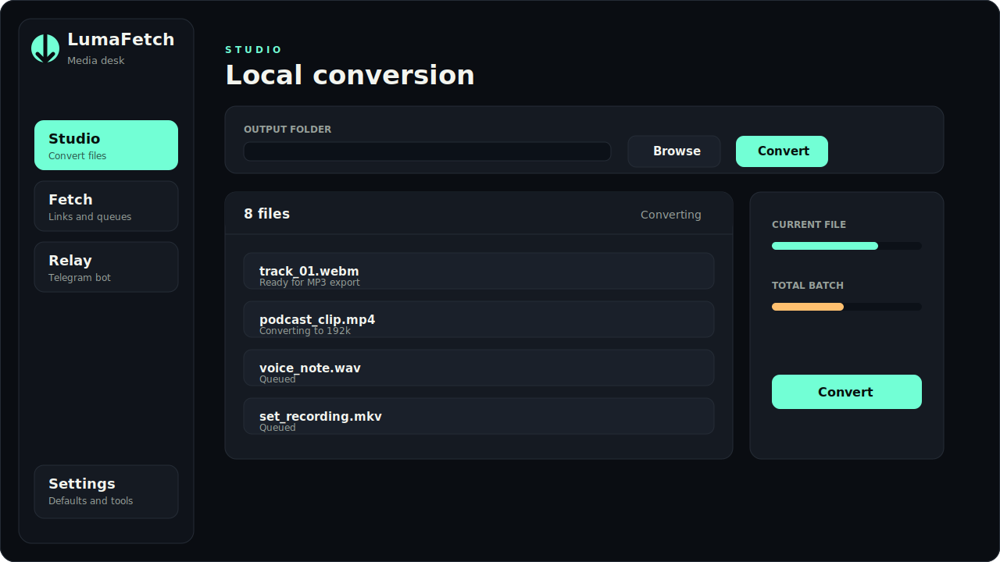

# LumaFetch

**Minimal Windows media desk for converting local files, fetching web media, and relaying downloads through a Telegram bot.**




---

## ✨ Highlights

- 🎵 **Convert** local media files to MP3 with batch progress tracking
- 📁 **Drag & Drop** files or whole folders into Studio
- 🔗 **Queue Management** - Paste one link or many links and run them as a queue
- 🌐 **Multi-Platform Support** - Download audio from YouTube, YouTube Music, TikTok, Instagram, SoundCloud, and 1000+ yt-dlp supported sites
- 🎬 **Quality Selection** - Real available quality selection after video analysis
- 🤖 **Telegram Bot Integration** - Send MP3/MP4 files to your chat with automatic cleanup
- 📊 **Rich Bot Commands** - `/start`, `/help`, `/status`, `/pause`, `/resume`, `/cancel`, `/playlist`, `/video`
- ⚙️ **Persistent Settings** - Theme, output folder, default quality, Telegram limits, cookies browser
- 🔧 **Auto Dependency Management** - Checks and installs ffmpeg and yt-dlp on launch
- 🧹 **Automatic Cleanup** - Temporary folders cleaned on startup and manually from Settings

---

## 📦 Installation

### Prerequisites

- **Windows 10/11** (64-bit)
- **Node.js 18+** (for development)
- **Python 3.9+** (for Telegram bot features)

### Quick Start

1. **Download the latest release** from [GitHub Releases](https://github.com/Kapustiack/LumaFetch/releases)
2. **Run the installer** (`LumaFetch Setup X.X.X.exe`)
3. **Follow the installation wizard**
4. **Launch LumaFetch** from your Start Menu

### Development Setup

```bash
# Clone the repository
git clone https://github.com/Kapustiack/LumaFetch.git
cd LumaFetch

# Install Node.js dependencies
npm install

# Install Python dependencies
pip install -r requirements.txt

# Run the application
npm start
```

---

## 📖 Usage Guide

### Studio (Local Conversion)

1. Click **Add files** or **Add folder** to select media
2. Choose output folder and MP3 quality (128k-320k)
3. Enable **Subfolders** for recursive folder scanning
4. Click **Convert** to start batch conversion
5. Monitor progress in real-time

**Supported Input Formats:** WebM, MP4, MKV, MOV, AVI, M4A, WAV, FLAC, OGG, Opus, AAC, MP3

### Fetch (Web Downloads)

1. Switch to **Fetch** tab
2. Select **Audio** or **Video** mode
3. Paste URL(s) - supports playlists and multiple links
4. For video: Click **Analyze** to see available qualities
5. Choose output folder and settings
6. Click **Download**

**Supported Platforms:** YouTube, YouTube Music, TikTok, Instagram, SoundCloud, Twitter/X, Facebook, Vimeo, Dailymotion, and 1000+ more via yt-dlp

### Relay (Telegram Bot)

1. Create a bot with [@BotFather](https://t.me/BotFather)
2. Copy the bot token
3. In LumaFetch, go to **Relay** tab
4. Paste token and click **Connect**
5. Optionally save token for future use
6. Start chatting with your bot on Telegram!

**Bot Commands:**
| Command | Description |
|---------|-------------|
| `/start` or `/help` | Show help message |
| `<link>` | Download as MP3 |
| `/playlist <link>` | Queue playlist with format options |
| `/video <link>` | Download video with quality selection |
| `/status` | Show queue with pause/resume/cancel controls |
| `/pause` | Pause current download |
| `/resume` | Resume paused download |
| `/cancel` | Cancel current operation |

**Pro Tip:** Enable **Lock chat** to restrict bot access to your chat only.

### Settings

Access the **Settings** tab to configure:

- **Theme**: Dark, Light, or System default
- **Default MP3 Quality**: 128k, 192k, 256k, or 320k
- **Default Video Quality**: Best, 1080p, 720p, 480p, 360p
- **Output Folder**: Default save location
- **Cookies Browser**: Use your browser's cookies for YouTube sign-in
- **Telegram Max Size**: Maximum file size (1-2000 MB)
- **Auto Update**: Enable/disable automatic updates

**Diagnostics Tools:**
- Refresh diagnostics
- Clean temporary files
- Check for updates

---

## 🛠️ Troubleshooting

### Common Issues

**"Dependencies not found"**
- Go to Settings → Tools
- Click "Install all" to download ffmpeg and yt-dlp
- Wait for installation to complete

**"YouTube download fails"**
- Update yt-dlp: Settings → Tools → Refresh diagnostics
- Set Cookies Browser to Chrome/Edge if you have YouTube Premium
- Try again with a different quality setting

**"Telegram bot doesn't respond"**
- Verify bot token is correct
- Check if bot is connected (green status)
- Ensure "Lock chat" isn't blocking your messages
- Restart the bot connection

**"File too large for Telegram"**
- Telegram has a 50MB limit for bots (2GB for Premium)
- Reduce quality settings in Fetch or Relay
- Consider downloading directly instead of via bot

**"SmartScreen warning on Windows"**
- This is normal for unsigned applications
- Click "More info" → "Run anyway"
- For production builds, code signing is recommended (see below)

### Getting Help

1. Check this README
2. Review [IMPROVEMENTS.md](./IMPROVEMENTS.md) for known limitations
3. Search existing [GitHub Issues](https://github.com/Kapustiack/LumaFetch/issues)
4. Create a new issue with detailed information

---

## 📸 Screenshots And Demo Assets

Store public screenshots and GIFs in `docs/screenshots/`:

- `app-overview.svg` - Lightweight visual preview (committed)
- Recommended screenshots:
  - Studio batch conversion
  - Fetch queue management
  - Relay bot controls
  - Settings diagnostics panel
- Recommended GIFs:
  - Drag-drop conversion workflow
  - Telegram playlist queue interaction
  - Update check process

---

## 🔒 Security

### Bot Token Storage
- Tokens are encrypted using Electron's `safeStorage` API when available
- Never share your bot token publicly
- Use "Lock chat" feature to restrict bot access

### Best Practices
- Only download media you own or have permission to download
- Keep the application updated
- Review [SECURITY.md](./SECURITY.md) for detailed security policy
- Report vulnerabilities responsibly (see SECURITY.md)

---

## 🚀 Building from Source

### Windows Build

```powershell
# Standard build (unsigned)
npm run build

# Signed build (requires certificate)
$env:CSC_LINK="C:\path\to\certificate.pfx"
$env:CSC_KEY_PASSWORD="your-password"
npm run build:signed

# Build and publish to GitHub
npm run build:publish
```

Build output is written to `release/` directory.

### Code Signing

For public releases, use a code signing certificate to avoid SmartScreen warnings:

```powershell
$env:CSC_LINK="C:\path\to\certificate.pfx"
$env:CSC_KEY_PASSWORD="certificate-password"
npm run build
```

⚠️ **Important:** Keep certificate files and passwords out of version control!

### Linux Build (Experimental)

```bash
npx electron-builder --linux appimage
```

---

## 📦 GitHub Releases and Updates

LumaFetch uses `electron-updater` for automatic updates from GitHub Releases.

### Creating a Release

1. **Build the installer:**
   ```bash
   npm run build
   ```

2. **Create a GitHub release:**
   - Tag format: `v0.4.0` (must match package.json version)
   - Upload from `release/`:
     - `LumaFetch Setup X.X.X.exe` (installer)
     - `latest.yml` (update metadata)
     - Other build artifacts

3. **Users can check for updates:**
   - Settings → Tools → Check updates
   - Automatic checks on startup (if enabled)

---

## 🤝 Contributing

We welcome contributions! Please see [CONTRIBUTING.md](./CONTRIBUTING.md) for guidelines.

### Quick Start for Contributors

```bash
# Fork and clone
git clone https://github.com/YOUR_USERNAME/LumaFetch.git
cd LumaFetch

# Create a branch
git checkout -b feature/amazing-feature

# Make your changes and test thoroughly
npm start

# Commit with clear messages
git commit -m "Add amazing feature"

# Push and create PR
git push origin feature/amazing-feature
```

### What We Need Help With

- 🐛 Bug fixes
- 🎨 UI/UX improvements
- 📝 Documentation
- 🌍 Translations
- ✅ Tests
- 🔒 Security enhancements

See [IMPROVEMENTS.md](./IMPROVEMENTS.md) for a comprehensive list of planned features.

---

## 📄 Legal

### License
This project is licensed under the MIT License - see the [LICENSE](./LICENSE) file for details.

### Usage Guidelines
⚠️ **Use LumaFetch responsibly:**
- Only download media you own, have permission to download, or are legally allowed to archive
- Respect copyright laws in your jurisdiction
- DRM-protected media is not supported and should not be circumvented
- This tool is for personal use and archival purposes

### Third-Party Components
LumaFetch uses:
- **[electron](https://www.electronjs.org/)** - Desktop framework (MIT)
- **[yt-dlp](https://github.com/yt-dlp/yt-dlp)** - Media downloader (Unlicense)
- **[ffmpeg](https://ffmpeg.org/)** - Media converter (LGPL/GPL)
- **[electron-builder](https://www.electron.build/)** - Build tool (MIT)
- **[electron-updater](https://www.npmjs.com/package/electron-updater)** - Auto-updater (MIT)

---

## 📞 Support

- **Issues:** [GitHub Issues](https://github.com/Kapustiack/LumaFetch/issues)
- **Discussions:** [GitHub Discussions](https://github.com/Kapustiack/LumaFetch/discussions)
- **Documentation:** See `docs/` folder
- **Changelog:** [CHANGELOG.md](./CHANGELOG.md)

---

## 🙏 Acknowledgments

- Thanks to the yt-dlp team for maintaining an incredible tool
- Inspired by various media downloaders and converters
- Built with ❤️ by Kapustiack

---

<div align="center">

**LumaFetch v0.4.0** | [Report Bug](https://github.com/Kapustiack/LumaFetch/issues) · [Request Feature](https://github.com/Kapustiack/LumaFetch/issues) · [View Improvements Roadmap](./IMPROVEMENTS.md)

</div>
